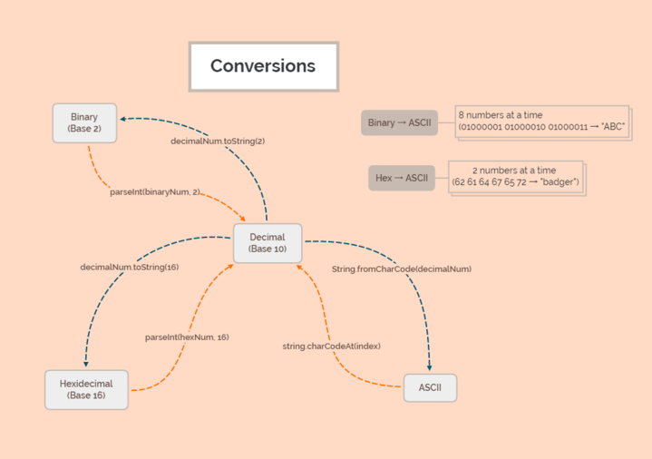

# M2W3D3

## Binary Practice (15 min)

## Lecture Part 1

### Key Logic and Truth Points

- ! = not
- && = both conditions are true
- || = one or both conditions are true
- XOR ( ^ ) = exclusive or, one is true, but not both

- True can be represented by 1, and false by 0.

- De Morgan's Law:
  !(A && B) === !A || !B

```plaintext
A | B XOR
-----
T | T  => F
T | F  => T
F | T  => T
F | F  => F
```

### Binary, base 10

You learned to count in a base 10 system. All numbers are based on a 0-9
counting pattern.
0, 1, 2, 3, 4, 5, 6, 7, 8, 9....

- when you get to the last digit, you simply increase the number to the left and
  start over from 0

### Binary, base 2

- 2 Key points:
  - binary is all 0s and 1s
  - binary digits are called bits
    - a group of 8 bits is a byte

#### How to count in binary

0000 - 0
0001 - 1
0010 - 2
0011 - 3
0100 - 4
0101 - 5
0110 - 6
0111 - 7
1000 - 8

- The pattern is: 0 and 1 are the same a base 10, but then you run out of digits.
  - The right most digit returns to 0 and the digit to the left increments by 1
- '0b' prefix identifies string/num as binary: 0b0100 -> 4
- Avoids confusion, 8 -> 0b1000 to differentiate from base 10 number 1000

### Converting from binary to decimal (base 10)

Formula: Multiply each digit by the number base raised to the nth power, where n
is its position _starting from the right_. Then, add all of the results together.

To convert 0b11001010 to decimal, remember the base is 2:

2^0 _0 = 0
2^1_ 1 = 2
2^2 _0 = 0
2^3_ 1 = 8
2^4 _0 = 0
2^5_ 0 = 0
2^6 _1 = 64
2^7_ 1 = 128

Add all of those sums together to get 2 + 8 + 64 + 128 = 202

## Write a javascript function that converts Binary to Decimal (20 min)

## Lecture Part 2

### Base 16 - Hexadecimal

hex = 6, dec = 10, hence hexadecimal (6 + 10 = 16)

Counting follows this pattern:
The digits are 0-9 with A, B, C, D, E and F representing 10, 11, 12, 13, 14 and
15, respectively. Hexadecimal numbers (sometimes called 'hex' for short) are
prepended with an '0x' to differentiate them as base-16.

- Hexadecimal is often used as shorthand for representing binary values:
  - one hex digit can represent four bits.

0 = 0b0000 = 0x0
1 = 0b0001 = 0x1
2 = 0b0010 = 0x2
3 = 0b0011 = 0x3
4 = 0b0100 = 0x4
5 = 0b0101 = 0x5
6 = 0b0110 = 0x6
7 = 0b0111 = 0x7
8 = 0b1000 = 0x8
9 = 0b1001 = 0x9
10 = 0b1010 = 0xA
11 = 0b1011 = 0xB
12 = 0b1100 = 0xC
13 = 0b1101 = 0xD
14 = 0b1110 = 0xE
15 = 0b1111 = 0xF
16 = 0x10
17 = 0x11
18 = 0x12
19 = 0x13
20 = 0x14
21 = 0x15
22 = 0x16
23 = 0x17
24 = 0x18

To convert A1 from hexadecimal to decimal, we use the same formula as above:

16^0 _1 = 1_ 1 = 1
16^1 _a (10) = 16_ 10 = 160

160 + 1 = 161

To convert the hex number 0xF23C:
16^0 _C = 1_ 12 = 12
16^1 _3 = 16_ 3 = 48
16^2 _2 = 256_ 2 = 512
16^3 _F = 4096_ 15 = 61440

Add the sums together to get 61440 + 512 + 48 + 12 = 62012

## Write a fuction that converts hex to decimal (20min)

## Lecture Part 3

### Bytes, kilobytes, megabytes, gigabytes, terabytes

1 byte = 8 bits

#### Recall from grade school

kilo - thousand
mega - million
giga - billion
tera - trillion
peta - quadrillion
exa - quintillion
zetta - sextillion
yotta - septillion

### ASCII

- `String.fromCharCode()`

```javascript
console.log(String.fromCharCode(65));
```

- `String.prototype.charCodeAt()`

```javascript
const str = "ABC";
console.log(str.charCodeAt(0));
```

## General Conversion Tips

```javascript
// Convert Hexadecimal to Base10 & back`
let num = parseInt("0xa1", 16); // 161
let str = Number(num).toString(16); // 'a1'
```

## Conversion graph

<span style='color:red'>NOT ALLOWED ON THE TEST</span>


## Binary Extra Practice
